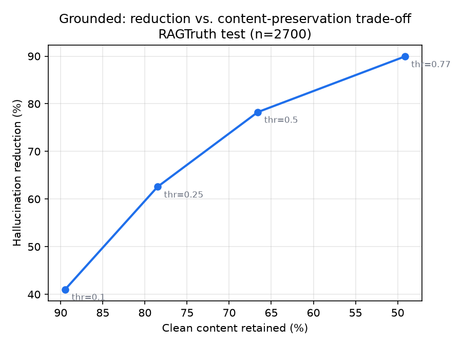

# Grounded — a self-correcting RAG layer with a measured hallucination reduction

> Built and measured on a CPU-only laptop. Generation runs locally via Ollama;
> all evaluation is offline/batch. The headline result is **hardware-independent**
> because it is a measured reduction on a public labelled benchmark.

## What it does

Grounded wraps a retrieval-augmented generation (RAG) pipeline with a
**verification + self-correction layer** that detects and removes claims an
answer makes that are **not grounded in the retrieved context**, and reports a
per-claim groundedness verdict.

```
query → retrieve → generate → decompose → verify each claim → correct → report
```

It is a **faithfulness** system: it checks whether each claim is *supported by
the retrieved evidence*, not whether the claim is true in the world. That is the
well-defined, measurable target.

## Headline result

On the **complete RAGTruth test set (n=2,700)**, drop-correction with the
MiniCheck verifier:

| Operating point | Hallucination rate | Relative reduction | Clean content kept |
|---|---|---|---|
| Baseline RAG | 34.9% | — | — |
| Grounded (conservative) | 20.6% | **41.0%** [37.9–44.2] | 89.5% |
| **Grounded (balanced)** | **13.1%** | **62.6%** [59.4–65.8] | 78.5% |
| Grounded (aggressive) | 3.5% | 89.9% [87.9–91.9] | 49.1% |

All reductions significant at p < 1e-100 (exact McNemar). 95% bootstrap CIs in
brackets. **The trade-off curve is the result** — aggressive correction removes
more hallucination but also more correct content; we measure both.



The verifier (MiniCheck, AUROC 0.85) beats a generic NLI baseline (DeBERTa-NLI,
0.78) and generalizes to a second benchmark (HaluEval, AUROC 0.78).

## Architecture

```
rag/        ingest (chunk+embed→Chroma) · retriever (BM25+dense, RRF) · generator (Ollama)
verify/     decompose (answer→atomic claims) · nli (MiniCheck + DeBERTa) · corrector (drop/flag/regenerate)
eval/       datasets (RAGTruth+HaluEval→one schema) · metrics · calibrate · run_eval · analyze (CIs)
            · cross_dataset · quality_judge · per_task_threshold · figures
pipeline.py the live path; server/ FastAPI /ask; dashboard/ color-coded claim UI
```

## Models (all CPU-friendly)

| Role | Model |
|---|---|
| Generator | `qwen2.5:3b-instruct` (Ollama, CPU) |
| Embeddings | `BAAI/bge-small-en-v1.5` |
| Verifier (primary) | `lytang/MiniCheck-DeBERTa-v3-Large` |
| Verifier (baseline) | `MoritzLaurer/DeBERTa-v3-base-mnli-fever-anli` |
| Vector store | ChromaDB (local) |

## Quickstart

```bash
python -m venv .venv && .venv/Scripts/python -m pip install -r requirements.txt
ollama serve &                       # in another terminal
ollama pull qwen2.5:3b-instruct

# 1. live demo (retrieve → generate → verify → correct)
.venv/Scripts/python scripts/ask.py "Why did the Emu War fail?"
.venv/Scripts/python -m uvicorn server.app:app --port 8000   # then open http://localhost:8000

# 2. reproduce the measurement (downloads RAGTruth + HaluEval once)
.venv/Scripts/python -m eval.baseline                        # baseline hallucination rate
.venv/Scripts/python -m eval.calibrate --method sentence     # calibrate the verifier
.venv/Scripts/python -m eval.run_eval --test-size 2700 --out data/correction_eval_full.json
.venv/Scripts/python -m eval.analyze --json data/correction_eval_full.json   # bootstrap CIs
.venv/Scripts/python -m eval.figures                         # report figures
```

Long eval runs checkpoint to `<out>.partial.jsonl` and resume automatically if
interrupted. See [REPORT.md](REPORT.md) for full methodology, ablations, and the
honest limitations.

## Honest limitations

- Correction has a real **answer-quality cost** at aggressive thresholds (an
  LLM-judge confirms it); we report it rather than claim "no quality loss".
- The verifier's **threshold is dataset-specific** — it ranks well across
  domains but the absolute cut-off needs recalibration per corpus.
- Numbers are **faithfulness** (grounding in retrieved context), not world-truth.
