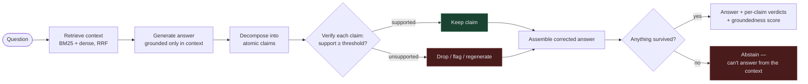
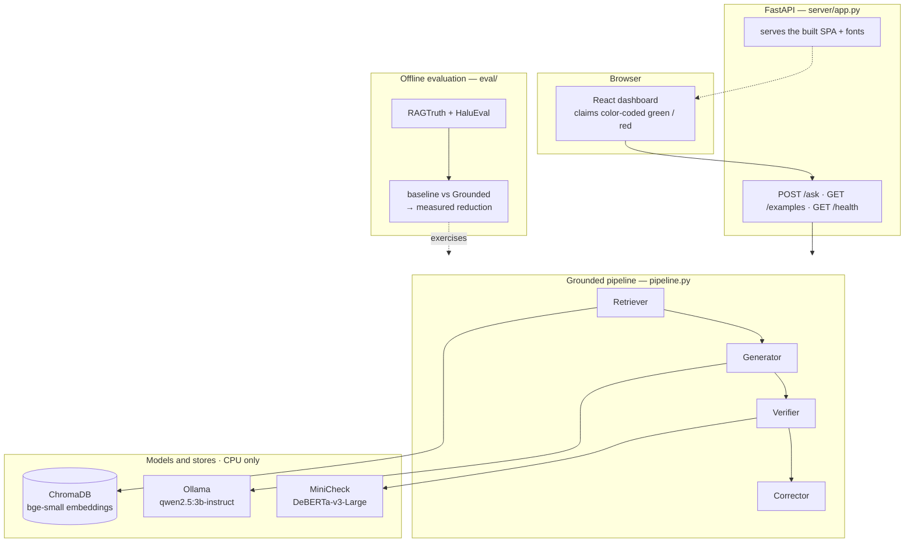
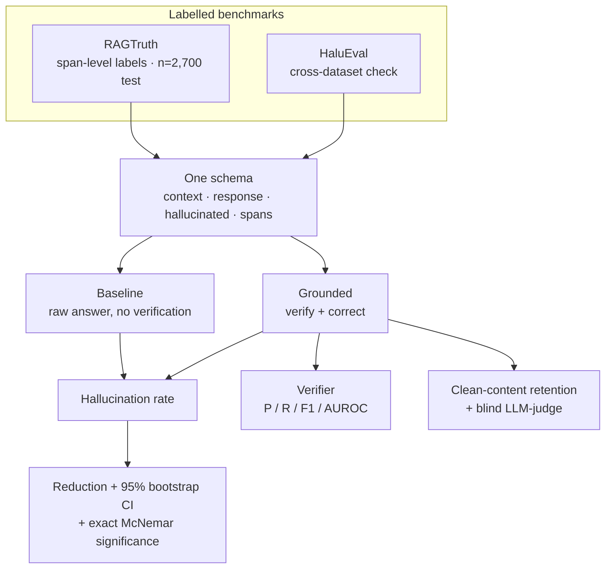
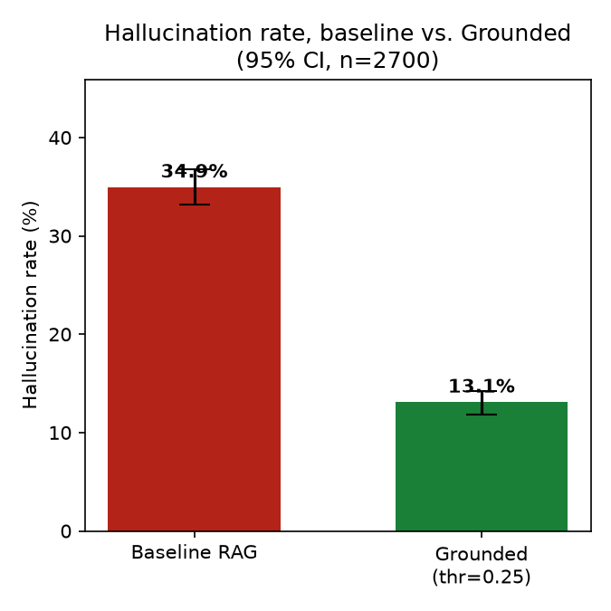
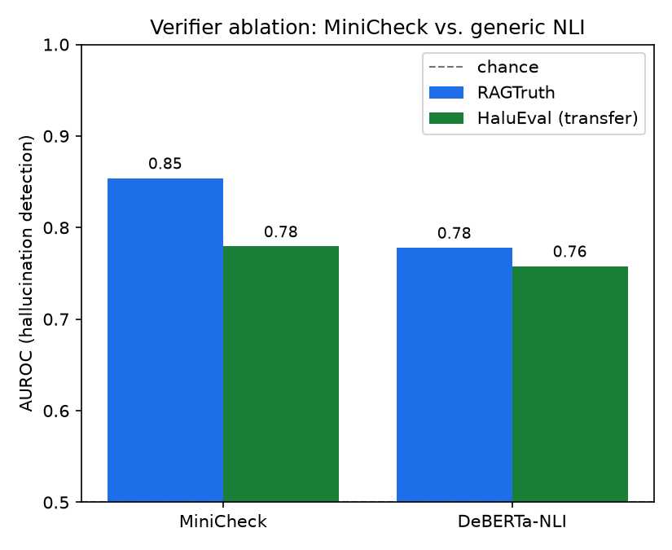

<div align="center">

# Grounded

### A self-correcting RAG layer with a *measured* hallucination reduction

Grounded wraps a retrieval-augmented generation pipeline with a verification and
self-correction layer that detects and removes claims **not grounded in the
retrieved context** — and reports a per-claim groundedness verdict you can see.

[](https://www.python.org/)
[](https://fastapi.tiangolo.com/)
[](https://react.dev/)
[](#tech-stack)
[](#evaluation)
[](LICENSE)

**[Method](#how-it-works)  ·  [Results](#headline-result)  ·  [Quickstart](#quickstart)  ·  [Report](REPORT.md)  ·  [Runbook](RUNBOOK.md)  ·  [Deploy](DEPLOY.md)**

</div>

> **In one sentence:** Grounded cuts the hallucination rate from **34.9% to 13.1%**
> on the RAGTruth benchmark (**−62.6%**, *p* < 1e-100) by decomposing answers into
> atomic claims and verifying each against the retrieved context with a calibrated
> fact-checking model — while **honestly measuring the answer-quality trade-off**.

The headline is a measured reduction on a public, labelled benchmark, so it is
**hardware-independent** — it holds regardless of the CPU laptop it was built on.

---

## Table of contents

- [Why this exists](#why-this-exists)
- [Headline result](#headline-result)
- [How it works](#how-it-works)
- [Architecture](#architecture)
- [Evaluation](#evaluation)
- [Tech stack](#tech-stack)
- [Quickstart](#quickstart)
- [Using the API](#using-the-api)
- [Project structure](#project-structure)
- [Configuration](#configuration)
- [Testing](#testing)
- [Deployment](#deployment)
- [Limitations](#limitations-the-honest-part)
- [Roadmap](#roadmap)
- [References](#references)
- [License](#license)
- [Author](#author)

---

## Why this exists

A RAG "hallucination" is usually a **faithfulness** failure: the answer asserts
something **not supported by the retrieved context**, even if it happens to be
true in the world. Grounded measures and reduces *faithfulness* failures —
grounding with respect to the retrieved evidence — which is the well-defined,
**measurable** target. This is deliberately distinct from *factuality*
(world-truth), which is not directly measurable without an oracle.

> If asked "are you checking truth or grounding?" — the answer is **grounding
> with respect to the retrieved context.**

---

## Headline result

On the **complete RAGTruth test set (n = 2,700)**, drop-correction with the
MiniCheck verifier. The **trade-off curve is the result**, not a single point —
aggressive correction removes more hallucination *and* more correct content, so
we measure both.

| Operating point | Hallucination (before → after) | Relative reduction | Clean content kept | Abstain |
|---|---|---|---|---|
| Baseline RAG | 34.9% | — | — | — |
| Conservative (thr 0.10) | 34.9% → 20.6% | **−41.0%** `[37.9–44.2]` | 89.5% | 1.7% |
| **Balanced (thr 0.25)** | **34.9% → 13.1%** | **−62.6%** `[59.4–65.8]` | 78.5% | 2.7% |
| Aggressive (thr 0.50) | 34.9% → 7.6% | −78.3% `[75.6–80.9]` | 66.6% | 5.0% |
| Maximal (thr 0.77) | 34.9% → 3.5% | −89.9% `[87.9–91.9]` | 49.1% | 11.9% |

All reductions significant at *p* < 1e-100 (exact McNemar on paired per-example
flips). Brackets are 95% percentile-bootstrap confidence intervals.


The verifier (**MiniCheck**, AUROC 0.85) beats a generic NLI baseline
(**DeBERTa-NLI**, 0.78) and its *ranking* generalizes to a second benchmark
(**HaluEval**, AUROC 0.78). Full methodology, ablations, and honest caveats are
in **[REPORT.md](REPORT.md)**.

---

## How it works



1. **Retrieve** — hybrid BM25 + dense (`bge-small`) retrieval fused with
   reciprocal-rank fusion. → [`rag/retriever.py`](rag/retriever.py)
2. **Generate** — `qwen2.5:3b-instruct` via Ollama, prompted to answer *only*
   from the retrieved context. → [`rag/generator.py`](rag/generator.py)
3. **Decompose** — split the answer into atomic, individually-checkable claims
   (a deterministic sentence splitter by default; an LLM atomic-claim decomposer
   is the finer optional variant). → [`verify/decompose.py`](verify/decompose.py)
4. **Verify** — score each claim's support against the context with a small
   fact-check encoder. Long contexts are chunked into overlapping windows and we
   take the **max support over windows** (a claim is grounded if *any* part of
   the context supports it). → [`verify/nli.py`](verify/nli.py)
5. **Correct** — drop / flag / regenerate unsupported claims; abstain if nothing
   survives. Correction can only **remove** content, never invent it — the
   property that makes "hallucination rate goes down" trustworthy.
   → [`verify/corrector.py`](verify/corrector.py)

> **Why a dedicated verifier instead of asking the LLM "is this grounded?"**
> A small purpose-built checker (MiniCheck) is faster on CPU, **calibratable**
> (we tune a threshold and report P/R/F1/AUROC), and reproducible — a generic LLM
> self-rating is slow, uncalibrated, and unreliable.

---

## Architecture



| Module | Responsibility |
|---|---|
| [`rag/`](rag/) | `ingest` (chunk + embed → Chroma) · `retriever` (BM25 + dense, RRF) · `generator` (Ollama) |
| [`verify/`](verify/) | `decompose` (answer → atomic claims) · `nli` (MiniCheck + DeBERTa) · `corrector` (drop/flag/regenerate) |
| [`pipeline.py`](pipeline.py) | the live path: retrieve → generate → decompose → verify → correct → report |
| [`eval/`](eval/) | `datasets` · `metrics` · `baseline` · `calibrate` · `run_eval` · `analyze` (CIs) · `cross_dataset` · `quality_judge` · `iteration_ablation` · `figures` |
| [`server/`](server/) | FastAPI app + Pydantic schemas; serves the SPA and the JSON API |
| [`frontend/`](frontend/) | React + Vite dashboard with the color-coded claim view |

---

## Evaluation

The whole project is "a measured reduction", so the evaluation is the real
artifact. Both benchmarks are loaded into one schema and run through an identical
harness — baseline (no verification) vs Grounded — over public labelled data.



**Baseline prevalence.** 34.9% of RAGTruth test responses are hallucinated
(Data2txt 64% · Summary 23% · QA 18%; by generator: GPT-4 9% → Mistral-7B 56% —
stronger models hallucinate less, as expected).

**Verifier detection quality — decomposition ablation** (MiniCheck):

| Verification granularity | AUROC | F1 |
|---|---|---|
| Whole-answer | 0.684 | 0.59 |
| **Sentence-level (decomposed)** | **0.854** | 0.57 |

Decomposition lifts ranking quality by **+0.17 AUROC** — MiniCheck is built for
single claims, so verifying whole multi-sentence answers under-uses it.

**Verifier ablation — MiniCheck vs generic NLI:**

| Verifier | RAGTruth AUROC | HaluEval AUROC (transfer) |
|---|---|---|
| **MiniCheck** (primary) | **0.854** | **0.779** |
| DeBERTa-NLI (baseline) | 0.778 | 0.758 |

The purpose-built checker wins on both. **Finding:** the *ranking* transfers
across datasets, but the *threshold* does not — it must be recalibrated per
domain.

**Answer-quality preservation — the honest cost.** A blind LLM-judge (randomized
A/B, only on answers correction changed, n=100 per threshold) prefers the original
over the corrected answer 66% vs 21% at the balanced point, narrowing to 54% vs
31% at the conservative point — the cost is real but markedly smaller with fewer,
cleaner edits. Reported, not hidden; see [REPORT.md §4.5](REPORT.md).

**Self-correction iterations (1 vs N).** An ablation of the Chain-of-Verification
regenerate loop (n=30) finds it genuinely iterates (60% of cases need a 2nd pass)
and stays faithful (residual unsupported ≈ 0), but **does not beat plain drop** on
quality (drop preferred 15 vs 12) — which is exactly why the headline uses drop.
See [REPORT.md §4.7](REPORT.md).

|  |  |
|:---:|:---:|

Every number is reproduced by a script in [`eval/`](eval/) over public
benchmarks; long runs checkpoint and resume.

---

## Tech stack

All models run on **CPU** — no GPU, no fine-tuning, no paid APIs.

| Role | Choice |
|---|---|
| Generator | `qwen2.5:3b-instruct` via **Ollama** (CPU) |
| Embeddings | `BAAI/bge-small-en-v1.5` |
| Verifier (primary) | `lytang/MiniCheck-DeBERTa-v3-Large` |
| Verifier (baseline) | `MoritzLaurer/DeBERTa-v3-base-mnli-fever-anli` |
| Retrieval | ChromaDB (cosine) + `rank-bm25`, reciprocal-rank fusion |
| API | FastAPI + Uvicorn (Pydantic v2) |
| Frontend | React 19 · Vite · Tailwind v4 · Framer Motion |

---

## Quickstart

**Prerequisites:** Python 3.12+, Node 22+, and [Ollama](https://ollama.com/)
running locally. ~16 GB RAM recommended.

```bash
# 1. install
python -m venv .venv
.venv/Scripts/python -m pip install -r requirements.txt   # Windows
# source .venv/bin/activate && pip install -r requirements.txt   # macOS/Linux

# 2. generator model
ollama serve &                    # in another terminal
ollama pull qwen2.5:3b-instruct

# 3. build the index + the frontend
GROUNDED_CORPUS=local .venv/Scripts/python -m rag.ingest   # fast 4-doc demo corpus
cd frontend && npm install && npm run build && cd ..

# 4a. run the demo (one server serves the UI + the API)
.venv/Scripts/python -m uvicorn server.app:app --host 127.0.0.1 --port 8000
#    → open http://localhost:8000

# 4b. or ask once from the CLI
.venv/Scripts/python scripts/ask.py "Why did the Great Emu War fail?"
```

Reproduce the headline measurement (downloads RAGTruth + HaluEval once):

```bash
.venv/Scripts/python -m eval.baseline                       # baseline hallucination rate
.venv/Scripts/python -m eval.calibrate --method sentence    # calibrate the verifier
.venv/Scripts/python -m eval.run_eval --test-size 2700 --out data/correction_eval_full.json
.venv/Scripts/python -m eval.analyze --json data/correction_eval_full.json   # bootstrap CIs
.venv/Scripts/python -m eval.figures                        # report figures
```

See **[RUNBOOK.md](RUNBOOK.md)** for the full operator guide (dev mode, the broad
Wikipedia corpus, and a troubleshooting table).

---

## Using the API

```bash
curl -X POST http://localhost:8000/ask \
  -H "Content-Type: application/json" \
  -d '{"query": "Why did the Great Emu War fail?", "top_k": 5, "mode": "drop"}'
```

```jsonc
{
  "query": "Why did the Great Emu War fail?",
  "corrected": "…",                 // answer after unsupported claims removed
  "groundedness": 0.75,             // fraction of claims supported
  "abstained": false,
  "threshold": 0.25,
  "claims": [
    { "text": "…", "support": 0.91, "supported": true,  "evidence": "…" },
    { "text": "…", "support": 0.12, "supported": false, "evidence": "…" }
  ],
  "sources": [ { "id": "great_emu_war#2", "source": "great_emu_war.md" } ],
  "note": ""
}
```

| Endpoint | Purpose |
|---|---|
| `POST /ask` | Live verify-and-correct (slow on CPU: ~60–120 s). Body: `query` (1–2000 chars), `top_k` (1–10), `mode` (`drop`\|`flag`\|`regenerate`). |
| `GET /examples` | Precomputed RAGTruth verification examples (instant). |
| `GET /health` | Liveness probe. |

---

## Project structure

```
grounded/
├── rag/                  retrieve + generate
│   ├── ingest.py         chunk + embed corpus → ChromaDB (local or Wikipedia)
│   ├── retriever.py      hybrid BM25 + dense (bge-small), reciprocal-rank fusion
│   └── generator.py      Ollama client (qwen2.5:3b-instruct)
├── verify/               the verification layer
│   ├── decompose.py      answer → atomic claims
│   ├── nli.py            (claim, context) → support score; MiniCheck + DeBERTa
│   └── corrector.py      drop / flag / regenerate, abstain
├── pipeline.py           the live path
├── eval/                 the measurement spine (datasets, metrics, calibrate, run_eval, analyze, …)
├── server/               FastAPI app (app.py) + Pydantic schemas
├── frontend/             React + Vite dashboard  (build → dist/)
├── data/corpus/          demo corpus (4 docs)
├── figures/              generated report figures
├── testsprite_tests/     generated test suites + reports (frontend + backend)
├── scripts/ask.py        CLI one-shot ask
├── REPORT.md             methodology, ablations, honest limitations
├── RUNBOOK.md            operator guide + troubleshooting
├── DEPLOY.md             the honest free-tier deployment story
└── Dockerfile            multi-stage build (SPA + API in one image)
```

---

## Configuration

Set via environment variables (full table in [RUNBOOK.md §6](RUNBOOK.md)):

| Variable | Default | Purpose |
|---|---|---|
| `OLLAMA_URL` | `http://127.0.0.1:11434` | Ollama endpoint (use `127.0.0.1`, not `localhost`) |
| `GROUNDED_GEN_MODEL` | `qwen2.5:3b-instruct` | generator model |
| `GROUNDED_CORPUS` | `wikipedia` | `wikipedia` \| `local` |
| `GROUNDED_RELEVANCE_FLOOR` | `0.40` | out-of-corpus pre-filter (the verifier is the real defense) |

---

## Testing

Generated end-to-end suites live in [`testsprite_tests/`](testsprite_tests/):

- **Backend** — TC001–TC010 over `/ask`, `/examples`, `/health`, validation
  (422), error mapping (503), and SPA/static serving. See
  [testsprite-backend-report.md](testsprite_tests/testsprite-backend-report.md).
- **Frontend** — TC001–TC026 over the hero demo, threshold slider, prefill,
  abstain, and reduced-motion. See
  [testsprite-frontend-report.md](testsprite_tests/testsprite-frontend-report.md).

---

## Deployment

The real artifact is the **offline evaluation**, which runs on a laptop and
produces the headline numbers + the figures. For a *public* demo, live CPU
generation is slow (~a minute per answer), so the honest options are a local
screen-recorded demo or a hosted lightweight mirror serving precomputed examples.
Full story — including the Docker image and free-tier caveats — in
**[DEPLOY.md](DEPLOY.md)**.

```bash
docker build -t grounded .
docker run -p 8000:8000 grounded     # → http://localhost:8000
```

---

## Limitations (the honest part)

- **Correction has a real answer-quality cost** at aggressive thresholds (an
  LLM-judge confirms it). We report the trade-off rather than claim "no quality
  loss" — the conservative operating point (−41% hallucination, 89.5% retention)
  trades far less quality for a still-substantial reduction.
- **The threshold is domain-specific.** The verifier's *ranking* generalizes
  across corpora; the absolute cut-off needs per-corpus recalibration.
- **Numbers are faithfulness** (grounding in the retrieved context), not
  world-truth.
- **Decomposition on a 3B model** imperfectly decontextualizes claims; a larger
  or distilled decomposer would help.

---

## Roadmap

- **Re-retrieval on unsupported claims** before dropping, to recover content
  instead of only removing it.
- A **stronger rewriter** for the regenerate loop — the 1-vs-N ablation showed a
  3B rewriter doesn't beat drop; a larger model might.
- A larger / distilled **atomic-claim decomposer**.
- **pgvector on Neon** as a "real backend" alternative to local Chroma.

---

## References

The implementation is original; the ideas build on:

- **RAGTruth** — Niu et al., *RAGTruth: A Hallucination Corpus for Developing Trustworthy Retrieval-Augmented LMs*, ACL 2024.
- **HaluEval** — Li et al., *HaluEval: A Large-Scale Hallucination Evaluation Benchmark for LLMs*, EMNLP 2023.
- **MiniCheck** — Tang et al., *MiniCheck: Efficient Fact-Checking of LLMs on Grounding Documents*, EMNLP 2024.
- **FActScore** — Min et al., *FActScore: Fine-grained Atomic Evaluation of Factual Precision*, EMNLP 2023.
- **Chain-of-Verification** — Dhuliawala et al., *Chain-of-Verification Reduces Hallucination in LLMs*, 2023.
- **SelfCheckGPT** — Manakul et al., *SelfCheckGPT: Zero-Resource Black-Box Hallucination Detection*, EMNLP 2023.
- **DeBERTaV3** — He et al., *DeBERTaV3: Improving DeBERTa using ELECTRA-Style Pre-Training*, 2021.

---

## License

Released under the [MIT License](LICENSE).

## Author

**Aryan Raj** ([@sirrj4rvis](https://github.com/sirrj4rvis)) — built as a
final-year major project. The code can be assisted; the ideas — measured
faithfulness reduction on a real benchmark, per-claim verification against
retrieved context, and the honest quality trade-off — are the project.
