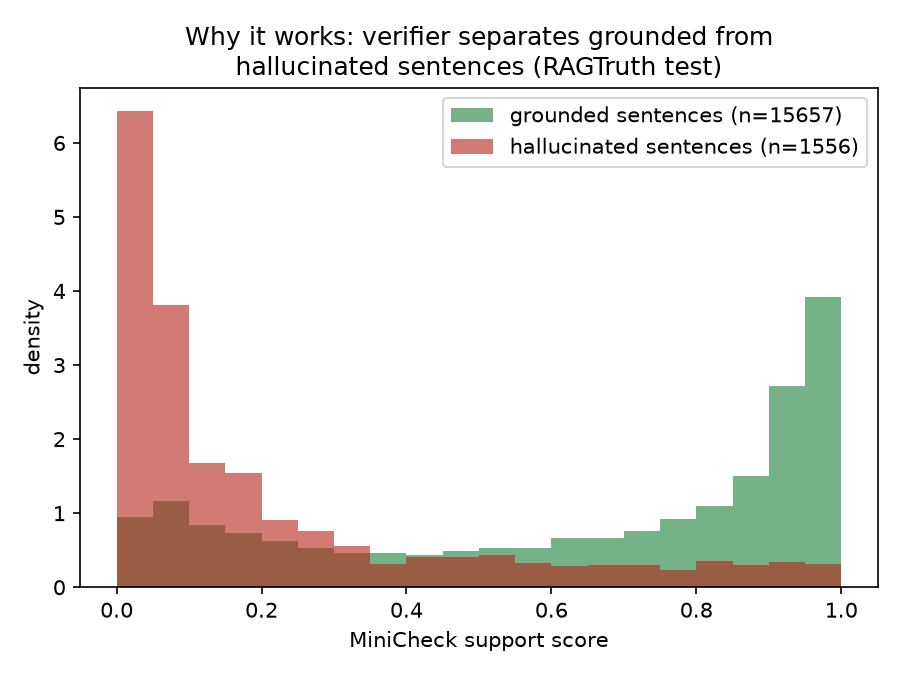

# Grounded: A Self-Correcting RAG Layer with a Measured Hallucination Reduction

**A faithfulness-verification and self-correction layer for retrieval-augmented
generation, evaluated on the RAGTruth and HaluEval benchmarks.**

---

## 1. Problem and framing

A RAG "hallucination" is usually a **faithfulness** failure: the answer asserts
something **not supported by the retrieved context**, even if it happens to be
true in the world. Grounded measures and reduces *faithfulness* failures —
grounding with respect to the retrieved evidence — which is the well-defined,
measurable target. This is distinct from *factuality* (world-truth), which is
not directly measurable without an oracle.

## 2. Method

```
query → retrieve → generate → decompose → verify each claim → correct → report
```

1. **Retrieve** — hybrid BM25 + dense (`bge-small`) retrieval fused with
   reciprocal-rank fusion (`rag/retriever.py`).
2. **Generate** — `qwen2.5:3b-instruct` via Ollama, prompted to answer only from
   context (`rag/generator.py`).
3. **Decompose** — split the answer into atomic, individually-checkable claims.
   A deterministic sentence splitter (free) is the default; an LLM atomic-claim
   decomposer is the finer, optional variant (`verify/decompose.py`).
4. **Verify** — score each claim's support against the context with a small NLI
   / fact-check encoder. Long contexts are chunked into overlapping windows and
   we take the **max support over windows** (a claim is grounded if any part of
   the context supports it) — essential for honest scores on long documents
   (`verify/nli.py`).
5. **Correct** — drop / flag / regenerate unsupported claims; abstain if nothing
   survives. Correction can only **remove** content, never invent it — the
   property that makes "hallucination rate goes down" trustworthy
   (`verify/corrector.py`).

### Why a dedicated verifier, not "ask the LLM if it's grounded?"

A small purpose-built checker (MiniCheck) is faster on CPU, **calibratable** (we
tune a threshold and report P/R/F1/AUROC), and reproducible — a generic LLM
self-rating is slow, uncalibrated, and unreliable.

## 3. Data

| Benchmark | Role | What it provides |
|---|---|---|
| **RAGTruth** (Niu et al. 2024) | primary | 18k LLM responses over retrieved context with **span-level** human hallucination labels; test split = 2,700 responses across QA / Summary / Data2txt |
| **HaluEval** (Li et al. 2023) | secondary | QA pairs, each with one faithful + one hallucinated answer (balanced) — cross-dataset generalization check |

Both are loaded into one schema (`eval/datasets.py`): `context` (premise),
`response` (hypothesis), `hallucinated` (label), `spans` (RAGTruth's finer
labels). Answer-level label = "≥1 annotated span". A correctness check on the
mapping: HaluEval comes out exactly 50% hallucinated, as it must by construction.

## 4. Results

### 4.1 Baseline hallucination rate

RAGTruth test, ground-truth prevalence: **34.9%** of responses are hallucinated
(Data2txt 64%, Summary 23%, QA 18%; GPT-4 9% → Mistral-7B 56% — stronger models
hallucinate less, as expected).

### 4.2 Verifier detection quality and the decomposition ablation

MiniCheck, RAGTruth test (n=90 calibration study):

| Method | AUROC | F1 |
|---|---|---|
| Whole-answer verification | 0.684 | 0.59 |
| **Sentence-level (decomposed)** | **0.854** | 0.57 |

Decomposition lifts ranking quality (AUROC) by **+0.17** — MiniCheck is built
for single claims, so verifying whole multi-sentence answers under-uses it.

### 4.3 Verifier ablation: MiniCheck vs generic NLI

| Verifier | RAGTruth AUROC | HaluEval AUROC (transfer) |
|---|---|---|
| **MiniCheck** (primary) | **0.854** | **0.779** |
| DeBERTa-NLI (baseline) | 0.778 | 0.758 |

The purpose-built checker beats generic NLI on both. **Finding:** the *ranking*
transfers across datasets, but the *threshold* does not — MiniCheck's
RAGTruth-tuned cut-off over-flags on HaluEval (precision 0.54), so thresholds
must be recalibrated per domain.


### 4.4 Headline: hallucination reduction (full RAGTruth test, n=2,700)

Drop-correction, MiniCheck, 95% bootstrap CIs, exact McNemar significance:

| Operating point | Halluc. before | Halluc. after | Relative reduction | Clean content kept | Abstain |
|---|---|---|---|---|---|
| Conservative (thr 0.10) | 34.9% | 20.6% | 41.0% [37.9–44.2] | 89.5% | 1.7% |
| **Balanced (thr 0.25)** | 34.9% | **13.1%** | **62.6% [59.4–65.8]** | 78.5% | 2.7% |
| Aggressive (thr 0.50) | 34.9% | 7.6% | 78.3% [75.6–80.9] | 66.6% | 5.0% |
| Maximal (thr 0.77) | 34.9% | 3.5% | 89.9% [87.9–91.9] | 49.1% | 11.9% |

All p < 1e-100. **The trade-off curve is the result**, not a single point.

 

Why it works — the verifier separates grounded from hallucinated sentences:



### 4.5 Answer-quality preservation (the honest cost)

A blind LLM-judge (qwen2.5:3b, randomized A/B, only answers correction changed)
compared original vs corrected, **n=100 per threshold**:

| Operating point | Original better | Corrected better | Tie |
|---|---|---|---|
| Balanced (thr 0.25) | 66% | 21% | 13% |
| Conservative (thr 0.10) | 54% | 31% | 15% |

Dropping sentences carries a real completeness cost — but it is markedly smaller
at the conservative operating point: corrected answers are preferred 31% of the
time at thr 0.10 vs 21% at thr 0.25, and the judge prefers the original far less
often (54% vs 66%). At n=100 this gap is **decisive, not just directional** (the
earlier n=30 study showed the same direction but was too noisy to lean on). One
caveat remains: the judge rates *completeness*, which structurally favors the
longer (uncorrected) answer even when the removed text was the hallucination, so
this overstates the true cost. The lesson is **operating-point selection** — the
conservative threshold (−41% halluc, 89.5% retention) trades far less quality for
a still-substantial reduction.

### 4.6 Per-task thresholds (negative result, honestly reported)

Calibrating a separate threshold per task (disjoint cal/eval halves of the test
set) gave only marginal benefit: sentence-detection F1 was flat (0.377 global vs
per-task), and downstream correction was roughly a wash (19.4% vs 21.0% after,
88.7% vs 89.7% retention). The more important insight: the F1-optimal threshold
is **~0.10**, far below the 0.77 that response-level min-aggregation produced —
the earlier over-flagging was a threshold-*level* problem, not a per-task one.

### 4.7 Self-correction iterations: 1 vs N (Chain-of-Verification)

The headline uses **drop** correction. The **regenerate** loop — rewrite the
answer from only the supported sentences, re-verify, repeat up to `max_iters` —
is the Chain-of-Verification alternative. Regenerated text has no RAGTruth span
labels, so we evaluate it with three label-free measures over n=30 changed
examples at thr 0.25 (`eval/iteration_ablation.py`):

| Question | Result (n=30) |
|---|---|
| Convergence — iterations the loop used | 1 pass: 12 (40%) · **2 passes: 18 (60%)** |
| A 2nd pass changed the answer | 18 / 30 (60%) |
| Faithfulness — residual unsupported in the rewrite | 0.8% (≈ 0) |
| Quality — regenerate vs drop (blind judge) | regen 12 · **drop 15** · tie 3 |
| Quality — regenerate vs original (blind judge) | regen 1 · original 24 · tie 5 |

Three findings: **(1) iteration is real** — 60% of examples needed a second pass,
so N>1 is not redundant (the first rewrite often still contains an unsupported
claim the next pass removes); **(2) the loop stays faithful** — residual
unsupported ≈ 0, confirming regeneration only re-expresses grounded material and
never smuggles ungrounded content past the final filter; but **(3) regeneration
does not beat drop** on answer quality (drop is in fact slightly preferred, 15 vs
12). The extra compute and drift-risk of the regenerate loop buy nothing over
simply deleting unsupported sentences — which is exactly why the headline uses
drop: simpler, deterministic, cheaper, and no worse. (Both, like all correction,
lose to the longer original on completeness — the same structural judge bias as
§4.5; with a 3B rewriter, regeneration adds no fluency advantage to offset it.)

## 5. Reproducibility

Every number above is produced by a script in `eval/` over public benchmarks;
long runs checkpoint and resume. See `README.md` for commands. Confidence
intervals are percentile bootstrap over examples (`eval/analyze.py`);
significance is exact McNemar on paired per-example flips.

## 6. Limitations and future work

1. **Quality cost is real** at aggressive thresholds; never claim "no quality
   loss". It is now measured at n=100 (§4.5): much smaller at the conservative
   0.10 point (corrected preferred 31% vs 21% at 0.25), but never zero.
2. **Threshold is domain-specific.** Ranking generalizes; the cut-off needs
   per-corpus recalibration.
3. **Decomposition on a 3B model** imperfectly decontextualizes claims (pronouns
   sometimes survive) — a larger or distilled decomposer would help.
4. **Regeneration does not beat drop.** The 1-vs-N ablation (§4.7) shows the
   regenerate loop iterates and stays faithful but does not improve quality over
   drop with a 3B rewriter; a stronger rewriter is the obvious thing to try next.

## 7. Viva-ready answers

- **Faithfulness vs factuality?** We measure grounding w.r.t. the retrieved
  context, not world-truth — the measurable target.
- **How is the threshold calibrated?** Max-F1 on a disjoint calibration split;
  P/R/F1/AUROC reported on test; AUROC is threshold-free.
- **How do you ensure correction doesn't strip correct info?** We measure it:
  clean-content retention + a blind LLM-judge, and report the full trade-off.
- **Why MiniCheck, not the LLM?** Calibration, speed, reproducibility — and it
  beats generic NLI (AUROC 0.85 vs 0.78) and generalizes (HaluEval 0.78).
